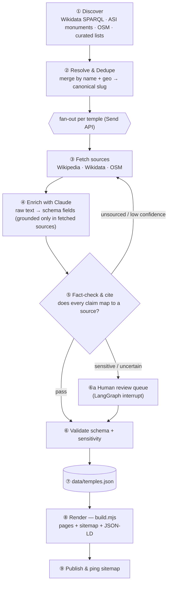
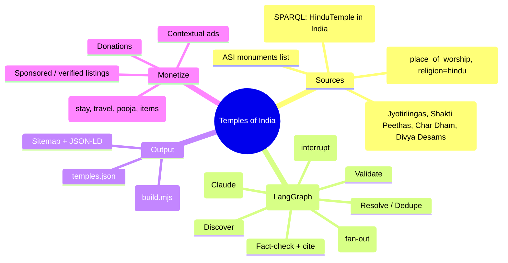

# Temples of India — End-to-End Pipeline (LangGraph)

LangGraph orchestrates "learn about every temple in India → a sourced dataset".
The static generator (`build.mjs`) renders that dataset into the website. The
boundary between them is **`data/temples.json`**.



## Mind map



## Node spec

| # | Node | Does | Key risk it controls |
|---|------|------|----------------------|
| 1 | `discover` | Enumerate candidate temples from Wikidata/ASI/OSM/curated lists | Coverage (don't miss the small ones) |
| 2 | `resolve` | Dedupe across sources by name + coordinates; assign canonical `slug` | Duplicate pages |
| 3 | `fetch` | Pull raw text + structured facts for one temple | Stale / thin data |
| 4 | `enrich` | Claude maps raw → our schema, **grounded only in fetched text** | Hallucinated history |
| 5 | `factcheck` | Verify each field traces to a source; attach citations | Unsourced claims |
| 6 | `validate` | JSON-schema + religious-sensitivity + legend-labeling checks | Bad/insensitive output |
| 6a | `review` | Human-in-the-loop queue for low-confidence / sensitive records | Reputational damage |
| 7 | `persist` | Append/update `data/temples.json` | — |
| 8 | `render` | `node build.mjs` → pages + sitemap | — |
| 9 | `publish` | Deploy + ping search engines | — |

## LangGraph skeleton (Python)

```python
from langgraph.graph import StateGraph, START, END
from langgraph.constants import Send
from langgraph.checkpoint.sqlite import SqliteSaver
from typing import TypedDict, Annotated, Literal
import operator

class Temple(TypedDict):
    slug: str
    raw: dict           # fetched source text/facts
    fields: dict        # enriched schema fields
    sources: list[str]
    confidence: float
    flags: list[str]

class PipelineState(TypedDict):
    candidates: list[dict]
    done: Annotated[list[Temple], operator.add]   # reducer merges fan-out results

def discover(state):  ...      # -> {"candidates": [...]}
def resolve(state):   ...      # dedupe + slugs
def fan_out(state):            # one sub-run per temple
    return [Send("fetch", {"slug": c["slug"]}) for c in state["candidates"]]
def fetch(state):     ...      # Wikipedia/Wikidata/OSM
def enrich(state):    ...      # Claude: raw -> fields (grounded)
def factcheck(state): ...      # attach citations, set confidence
def validate(state):  ...      # schema + sensitivity
def persist(state):   ...      # write data/temples.json

def route(state) -> Literal["fetch", "review", "validate"]:
    if "unsourced" in state["flags"]:        return "fetch"     # loop back
    if state["confidence"] < 0.6:            return "review"    # human gate
    return "validate"

g = StateGraph(PipelineState)
for n, fn in [("discover",discover),("resolve",resolve),("fetch",fetch),
              ("enrich",enrich),("factcheck",factcheck),
              ("validate",validate),("persist",persist)]:
    g.add_node(n, fn)
g.add_edge(START, "discover")
g.add_edge("discover", "resolve")
g.add_conditional_edges("resolve", fan_out, ["fetch"])   # parallel fan-out
g.add_edge("fetch", "enrich")
g.add_edge("enrich", "factcheck")
g.add_conditional_edges("factcheck", route, {"fetch":"fetch","review":"validate","validate":"validate"})
g.add_edge("validate", "persist")
g.add_edge("persist", END)

# resumable across a months-long crawl; pauses at the human-review gate
app = g.compile(checkpointer=SqliteSaver.from_conn_string("crawl.db"),
                interrupt_before=["validate"])   # human approves low-confidence first
```

> Then: `node build.mjs` consumes `data/temples.json` → site. Discovery and
> render are decoupled, so you can re-crawl without touching the front end, and
> re-skin the front end without re-crawling.

## Honest caveats
- **"All temples" is a long crawl.** Wikidata/OSM coverage is uneven for tiny
  shrines — expect to start with well-covered sets and widen over months.
- **Licensing:** Wikipedia/Wikidata are CC BY-SA, OSM is ODbL — attribute and
  keep the citations (we already render a Sources block per page).
- **Cost & rate limits:** batch the Claude enrich calls and respect source API
  limits; the checkpointer lets you run it in cheap nightly chunks.
- **Accuracy is the moat.** The fact-check loop + human gate are not optional —
  they're the reason this becomes the trusted reference instead of AI slop.
```
